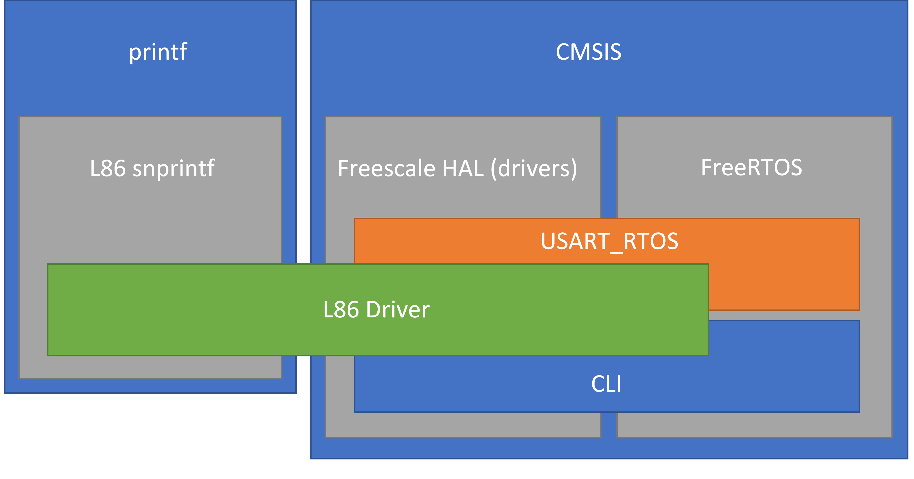

# TP Final de la materia PCSE de CESE

### Bibliotecas originales:

1. CMSIS
2. fsl_xxxxx
3. FreeRTOS

### Bibliotecas modificadas: 

1. printf: mpaland/printf
   - Agregada la función "vfctprintf"

### Bibliotecas basadas en otras existentes:

1. CLI: FreeRTOS/FreeRTOS/tree/main/FreeRTOS-Plus/Source.
   - Se utilizó la estructura de lectura de primer string como comando.
   - Se utilizó la estructura de comandos, quitándole el "help".
   - Ahora se pueden instanciar múltiples CLI para procesar distintos comandos.
   - Ya no se toma el espacio como separador. Se utiliza un string de tokens configurables.
2. usart_rtos: fsl_usart_freertos (SDK LPC55S14).
   - Se utilizo similar estructura del handler, utilizando un semáforo para toda la UART, en ves de uno para Tx y otro para Rx.
   - Se cambió el "event group" por "task notifications", incluyendo estructuras para la notificación a la tarea correspondiente.
   - La estructura interna de las funciones se cambio casi completamente, ya que se implementó la lectura "URC" en la cual se continúa recibiendo datos aún cuando no se envió nada. y se considera un string recibido cuando se recibe un '\n' 

### Bibliotecas creadas

1. L86.
   - Se implementó la comunicación con este módulo de Quectel mediante el envío de comandos (PMTK y PQ), y recepción de tramas NMEA.
2. L86_printf
   - para realizar un snprintf, formateando el string enviado apto para recibir por el módulo. Según nmea "$%s*XX" es decir, se coloca un '$' al comienzo, y el checksum al final.